<!-- omit in toc -->
# FTDI Connector: USB to Wifi converter using RaspBerry PI W 0 in D2XX mode and Asynchronous FIFO 245
<!-- markdownlint-configure-file { "MD013": { "line_length": 100 } } -->
- [User Guide](#user-guide)
  - [Requirements](#requirements)
  - [Raspbian Installation](#raspbian-installation)
  - [Setup](#setup)
  - [Wifi Configuration](#wifi-configuration)
- [Developer Guide](#developer-guide)

## User Guide

### Requirements

- Personal Computer or notebook with SD/micro SD reader, connected to WiFi network
- Raspberry PI (I have tested on Raspberry PI W 0. I think should work every where on Raspberry
  family devices)
- Raspbian Buster
- Micro SD card
- Ubuntu 19.10 (eoan) for the setup. I suppose should work also with diferent Ubuntu releases.

### Raspbian Installation

Raspbian lite must be downloaded. We will use the most recent version at the moment code name Buster.
To do this we first download the imager made available on the Raspberry website at
[Rasbian Imager](https://www.raspberrypi.org/downloads/).

With the Imager it is possible to erase the micro SD card and to download the Operative System that
you prefer.

To delete the contents from the SD Cards, press the OS button and then the Erase option from the next
menu.
Choose the SD Card on which you want to write by pressing the Chose SD Card button and then press
the Write button to write.

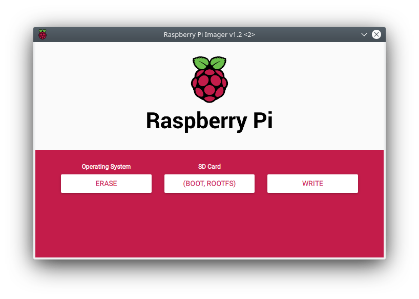

After erasing the SD Card you have to write the Operative System. Press the OS Button, then chose
**Raspbian other >  Raspbian Lite**.

Chose **WRITE** to write.

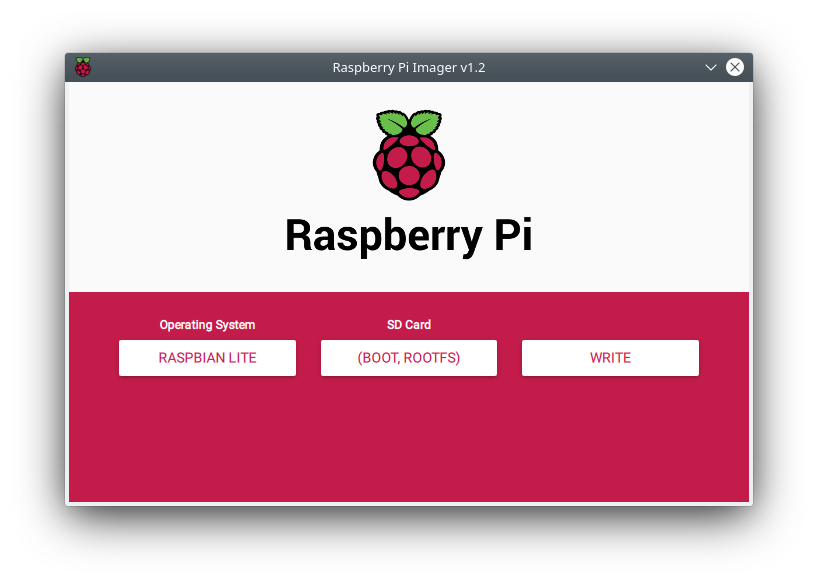

### Setup

After writing the operating system to the SD card, the following operations must be carried out in
order to carry out the setup:

1. Mount the SD Card to any directory of your PC.
2. Go to the directory where you have mounted the SD card: you'll see two partitions,
   **boot** and **rootfs**
3. Enter in the boot partition and execute the comman
```touch ssh```
4. Go back to the parent directory and enter in the rootfs partition. Go to **/etc/wpa_supplicant directory**
5. Operating as superuser edit the **wpa_supplicant.conf** using the command ```sudo nano wpa_supplicant.conf```
6. Edit the wpa_supplicant.conf file to reflect your wifi network configuration.

The **wpa_supplicant.conf** file has this kind of structure.

```bash
ctrl_interface=DIR=/var/run/wpa_supplicant GROUP=netdev
update_config=1
country=IT

network={
 ssid="<your Home WiFi network SSID>"
 psk="<your Home WiFi network passphrase>"
 key_mgmt=WPA-PSK
}
```

You can download an example of this file at this link [wpa_supplicant.conf](https://github.com/ZepHakase22/ecubit/releases/download/v1.0/wpa_supplicant.conf)
after removing if exists another wpa_supplicant.conf eventually in the directory.

For example:

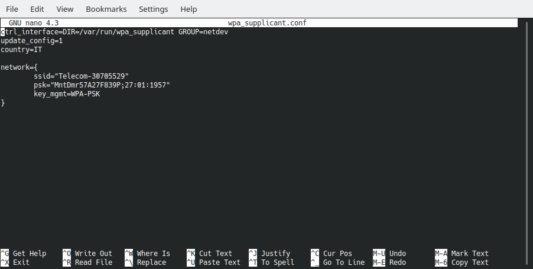

Replace your network data and save.

Go to the directory **rootfs/home/pi** and run the following commands:

```bash
wget https://github.com/ZepHakase22/ecubit/releases/download/v1.0/rasp-setup
chmod +x rasp-setup
```

Alternatively you can download it at this link [rasp-setup](https://github.com/ZepHakase22/ecubit/releases/download/v1.0/rasp-setup).

Unmount the **boot** and **rootfs** partitions and extract the SD card. Insert the micro SD card
inside the Raspberry reader drive.
Start the Raspberry. If everything is ok you shoud have Raspbian Buster installed, wifi installed
and the SSH Server service configured.

To resolve the IP address you can or find the address of your PI on the router WiFi or you need to
connect a monitor to the PI HDMI output and a keyboard to rhe micro-USB. In this case login with

```bash
username: pi
password: raspberry
```

and run the command ```ifconfig``: you should receive something like this:

```bash
pi@raspberrypi:~ $ ifconfig
lo: flags=73<UP,LOOPBACK,RUNNING>  mtu 65536
        inet 127.0.0.1  netmask 255.0.0.0
        inet6 ::1  prefixlen 128  scopeid 0x10<host>
        loop  txqueuelen 1000  (Local Loopback)
        RX packets 0  bytes 0 (0.0 B)
        RX errors 0  dropped 0  overruns 0  frame 0
        TX packets 0  bytes 0 (0.0 B)
        TX errors 0  dropped 0 overruns 0  carrier 0  collisions 0

wlan0: flags=4163<UP,BROADCAST,RUNNING,MULTICAST>  mtu 1500
        inet 192.168.1.60  netmask 255.255.255.0  broadcast 192.168.1.255
        inet6 fe80::827f:74a8:7601:9253  prefixlen 64  scopeid 0x20<link>
        ether b8:27:eb:3b:a4:d8  txqueuelen 1000  (Ethernet)
        RX packets 805  bytes 125975 (123.0 KiB)
        RX errors 0  dropped 0  overruns 0  frame 0
        TX packets 273  bytes 45852 (44.7 KiB)
        TX errors 0  dropped 0 overruns 0  carrier 0  collisions 0

pi@raspberrypi:~ $
```

The IP attached to the wlan0 is ours. Write this IP-address on some paper and ahead disconnect the
monitor and the keyboard.

From an Unix computer inside the WiFi network now you can connect via SSH. On Unix by the command:

```bash
ssh pi@IP-address
```

You'll receive the following message:

```bash
The authenticity of host '192.168.1.60 (192.168.1.60)' can't be established.
ECDSA key fingerprint is SHA256:wQpZcGkN1q398KIJ3PpDV9RNjKc7bXUZ7kMKI75b+yg.
Are you sure you want to continue connecting (yes/no/[fingerprint])?
```

Go ahead and answer **yes**, insert the password (raspberry) and go ahead!!</br>
You are working now on the Raspberry.

If you want change the password to the raspberry pi user, run the command ```passwd```.
Run the following command:

```bash
echo "pi      ALL=(ALL) NOPASSWD: ALL" | sudo tee -a /etc/sudoers && usermod -a -G root pi
```

and

```bash
reboot
```

Logout and then login again and run the command

```bash
./rasp-setup 1.0
```

****NOTE:**** *The setup has three phase: initialization, systemd.service creation, and wifi direct
hotspot creation. If you want to run rasp-setup step by step you can run rasp-setup in the following
order:*

```bash
./rasp-setup -i 1.0
./rasp-setup -s
./rasp-setup -n
```

At the end of the ```rasp-setup -i 1.0``` command it will be convenient reboot the system.

```bash
reboot
```

After reboot test the static program with the command:

```bash
ftd2pc -h
```

that produces command line help

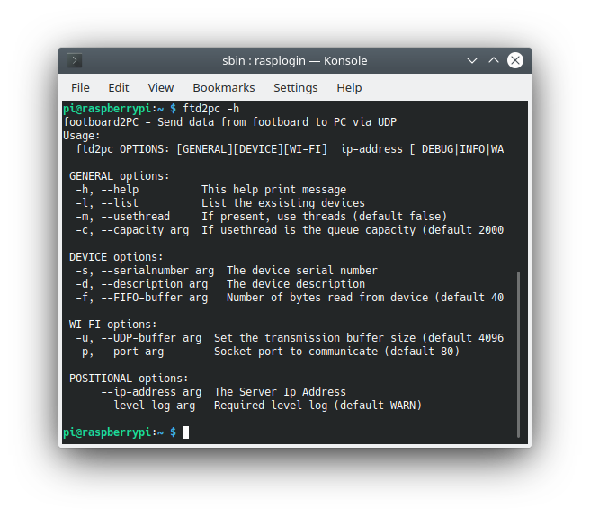

and

```bash
ftd2pc -l

```

that tests the footboard and produces

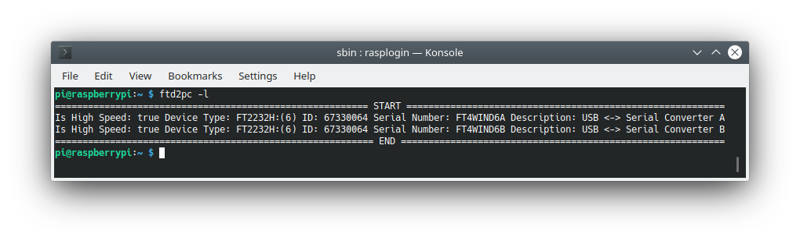

if you want work with the version that uses shared library use ```ftd2pcso``` instead of ```ftd2pc```

### Start ftd2pc as systemd service

If you want start ftd2pc as service run the command

```bash
rasp-setup -s
```

The following menu' will appear


1. Open By Serial Number: the following mask will appear.
   You need insert the Serial Number of the FT device. If the Description has already been entered,
   the program will not give the possibility to provide the Serial Number. If you are wrong and you
   have provided the Description and you have now decided to provide the Serial Number, you need
   before provide a null Description then you will provide the Serial Number that you want. In
   this example FT4WIND6A and FT4WIND6B are the Serial Numbers of the devices present on the board.
   Chose one of this. The field is not mandatory but one of Serial Number and the Description must
   be provided.
   </br>**NOTE:** *By design there is no control you input one of this.

  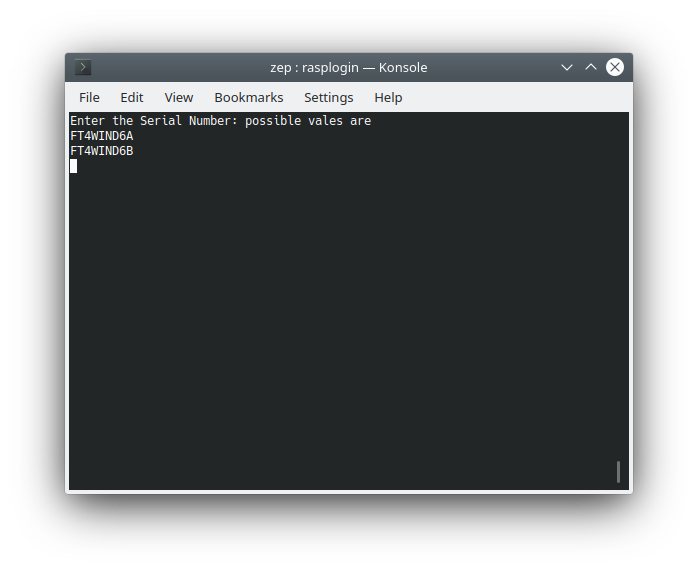

2. Open By Description: the following mask will appear.
   You need insert the Serial Number of the FT device. If the Serial Number has already been
   entered, the program will not give the possibility to provide the Description. If you are wrong
   and you have provided the Serial Number and you have now decided to provide the Description, you need
   before provide a null Serial Number then you will provide the Description that you want. In this
   example USB <-> Serial Converter A and USB <-> Serial Converter B are the description of the
   devices present on the board. Chose one of this. The field is not mandatory but one of Serial
   Number and Description must be provided.
   </br>**NOTE:** *By design there is no control you input one of this.

  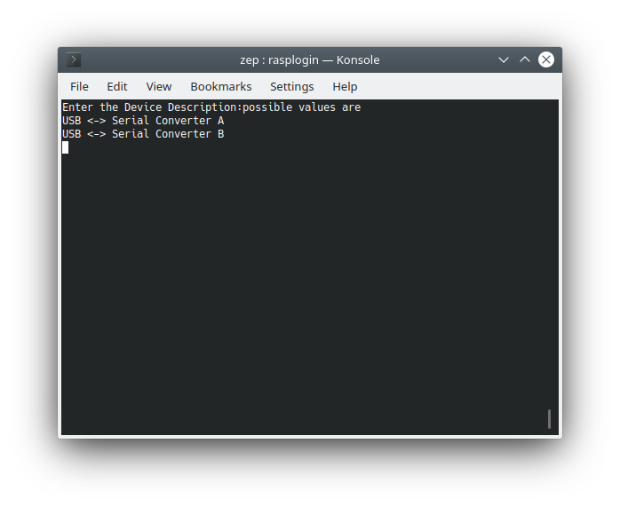

3. Use Thread: the following mask will appear.
   If the loading speed of the FIFO 245 is greater than the emptying speed it is possible that you want
   to decouple the two phases, so there will be a reading thread from the queue and a data sending
   thread via UDP. Choose **yes** if you want to work in this mode. The default value is **no**

  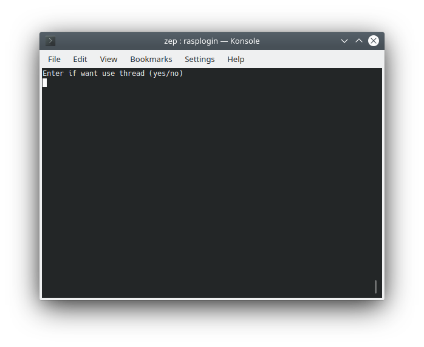

4. Capacity: the following mask will appear.
   If you have chosen to work in decoupled mode (use thread = yes) you must also define how many
   records can be read before the read thread stops and wait for the write thread to free up space.
   Otherwise this option will be disabled. The default is 2000 records.

  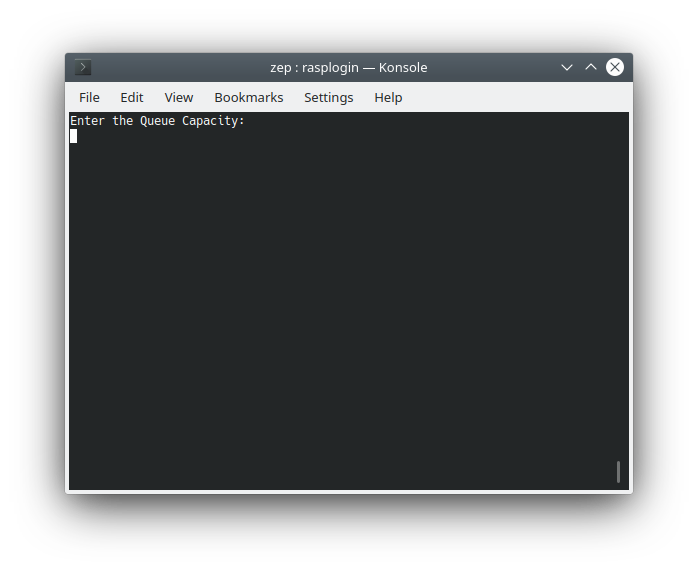

5. FIFO Buffer: the following mask will appear.
   The FIFO buffer are the byte numbers that are read simultaneously from the FIFO queue.
   The maximum value of bytes that can be read is 65536. If no value is entered, the default value
   assumed is 4096.
  
  

6. UDP Buffer: the following mask will appear.
   This is the number of bytes you want send to the server in unique sendto. As UDP is not
   connection oriented there's no way to indicate that two packets belong together. As a result
   you're limited by the maximum size of a single IP packet (65535). The data you can send is
   somewhat less that that, because the IP packet size also includes the IP header (usually 20 bytes)
   and the UDP header (8 bytes). So The correct maximum UDP message size is 65507, as determined by
   the following formula:

   ```bash

   0xffff - (sizeof(IP Header) + sizeof(UDP Header)) = 65535-(20+8) = 65507

   ```
  
   Note that this IP packet can be fragmented to fit in smaller packets (eg. ~1500 bytes for ethernet).
   That being said, most protocols limit to a much smaller size - usually either *512* or occasionally
   *8192*. You can often go higher than 548 safely if you are on a reliable network - but if you're
   broadcasting across the internet at large, the larger you go, the more likely you'll be to run
   into packet transmission problems and loss. If no value is entered, the default value
   assumed is 4096.

   

7. Server UDP Port number: the following mask will appear.
   This is the UDP Server port number where will listen to receive data. If no value is entered, the
   default value assumed is 80.

   

8. Server IP Address: the following mask will appear.
   The IP address of the Server (at this moment the computer where you are installing from on the
   lan). We will change this address after installing the Hot Spot on the Raspberry.
    You must enter this address in the form **xxx.yyy.zzz.ttt**. This field is a **mandatory** field.

   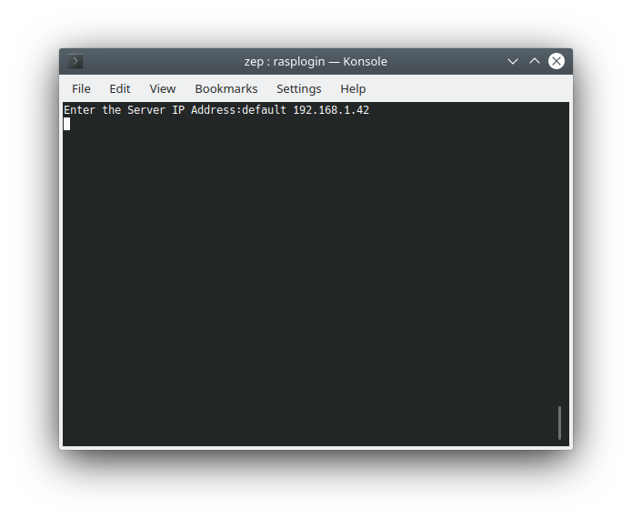

9. Log level: the following mask will appear.
   The Log Level you want to have. You can enter one of the permitted value in *upper* or *lower* case.

   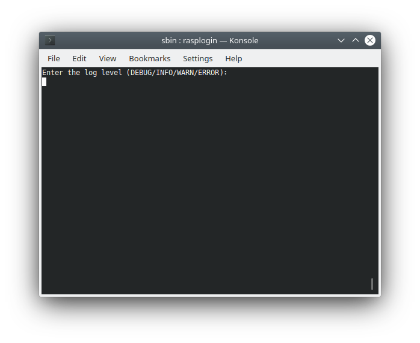
   
10. Use static or dynamic library: the following mask will appear.
    You can enter one of the permitted in upper or lower case to use the ftd2pc statically linked program
    or the ftd2pcso dynamically linked library.

    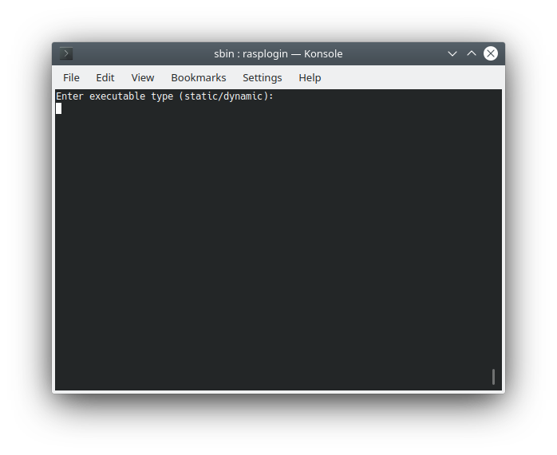

11. Save and Exit: The program will control the mandatory data are provided. If some of the
    mandatory field are not provided the program respond with this message:

    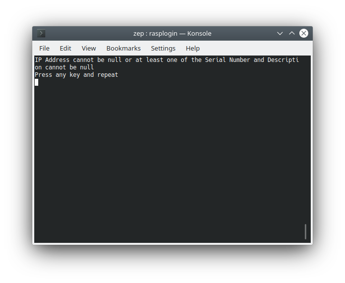

At this point the service should be installed and started. Reboot the system and run the command

```bash
journal -f -u ftd2pc.service
```

The result should be a log window showing the events reported by the service according to the level
log requested.

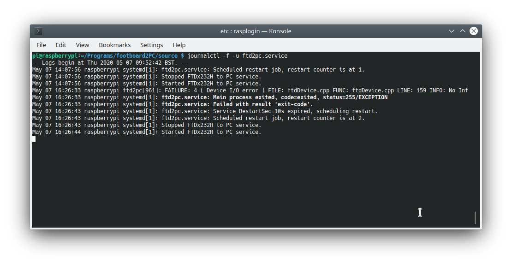

You can stop the service using the command:

```bash
sudo systemctl stop ftd2pc.service
```

and the result is:

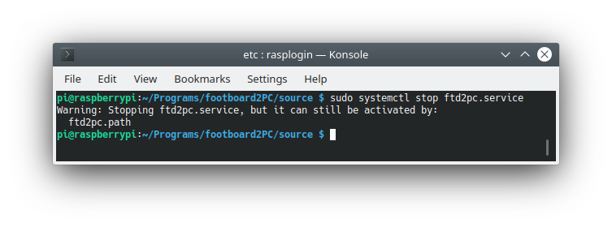

That means that the service is down but if you plug and unplug the USB connected to the Raspberry
the service will restart.

At the end, if you want, you can start the service with the command

```bash
sudo systemctl start ftd2pc.service
```

The service is a systemd service so see ```man SYSTEMD(1)```  for more informations.

### Wifi Configuration

## Developer Guide
